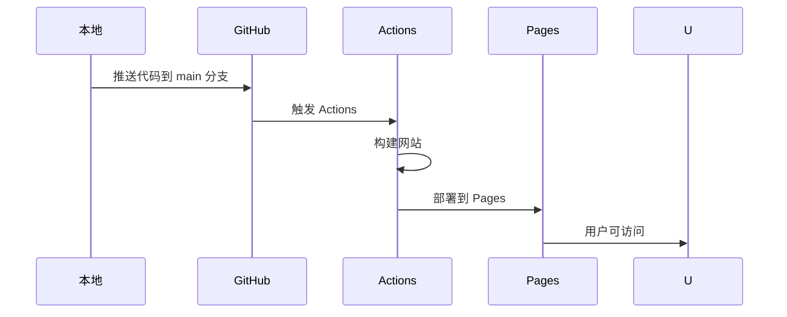

# 🎓 我的个人博客完全指南

## 📖 目录
1. [博客系统概述](#博客系统概述)
2. [项目结构详解](#项目结构详解)
3. [Hexo 工作原理](#hexo-工作原理)
4. [静态网站生成器概念](#静态网站生成器概念)
5. [部署流程和原理](#部署流程和原理)
6. [常用操作指南](#常用操作指南)
7. [进阶学习建议](#进阶学习建议)
8. [相关技术知识](#相关技术知识)

---

## 🌟 博客系统概述

### 什么是我的博客系统？

你的博客是一个基于 **Hexo** 框架构建的**静态网站**，具有以下特点：

- **技术栈**：Hexo（静态网站生成器）+ Next（主题）+ GitHub Pages（托管）
- **特点**：快速、安全、免费、易于维护
- **适用人群**：技术爱好者、写作者、学生、任何想建立个人网站的人

### 为什么选择这个方案？

#### 优势对比
| 方案 | 成本 | 技术难度 | 维护难度 | 功能性 |
|------|------|----------|----------|--------|
| **Hexo + GitHub Pages** | 免费 | 中等 | 低 | 丰富 |
| WordPress | 需要服务器 | 低 | 中 | 很丰富 |
| 自己写代码 | 需要服务器 | 高 | 高 | 完全自定义 |
| 其他平台（知乎、Medium）| 免费 | 很低 | 很低 | 受限 |

#### 具体优势
- **零成本**：不需要购买服务器或域名
- **高速度**：静态页面加载极快
- **高安全性**：没有数据库，不易被攻击
- **版本控制**：所有内容都用 Git 管理
- **写作专注**：专注于内容创作，不用关心技术细节

---

## 📁 项目结构详解

### 完整目录结构
```
my-blog/
├── .github/                 # GitHub 相关配置
│   └── workflows/           # GitHub Actions 工作流
│       └── deploy.yml       # 自动部署配置
├── node_modules/            # Node.js 依赖包
├── public/                  # 生成的静态文件（部署用）
├── scaffolds/              # 文章模板
│   ├── draft.md            # 草稿模板
│   ├── page.md             # 页面模板
│   └── post.md             # 文章模板
├── source/                 # 源文件（你主要编辑的地方）
│   ├── about/              # 关于页面
│   │   └── index.md        # 页面内容
│   ├── _posts/             # 博客文章
│   │   ├── hello-world.md  # 默认文章
│   │   └── 我的第一篇博客.md # 你的文章
│   ├── categories/         # 分类页面（自动生成）
│   ├── tags/               # 标签页面（自动生成）
│   └── ...                 # 其他页面
├── themes/                 # 主题文件
│   └── next/               # Next 主题
├── _config.landscape.yml   # 默认主题配置（可删除）
├── _config.yml             # Hexo 主配置文件
├── package.json            # 项目依赖配置
├── package-lock.json       # 依赖版本锁定文件
└── 各种指南文档           # 我为你创建的帮助文档
```

### 核心文件详解

#### 1. `_config.yml` - 主配置文件
这是最重要的配置文件，控制整个博客的行为：

```yaml
# 网站基本信息
title: 我的个人博客           # 博客标题
subtitle: 记录生活，分享知识  # 副标题
description: 欢迎来到我的个人博客  # 网站描述
author: 你的名字             # 作者
language: zh-CN             # 语言
timezone: Asia/Shanghai     # 时区

# URL 设置
url: https://zyccxy33.github.io  # 你的博客地址
permalink: :year/:month/:day/:title/  # 文章URL格式

# 主题设置
theme: next                 # 使用的主题

# 其他配置...
```

#### 2. `package.json` - 项目配置
```json
{
  "name": "hexo-site",
  "version": "0.0.0",
  "private": true,
  "scripts": {
    "build": "hexo generate",  # 构建命令
    "clean": "hexo clean",      # 清理命令
    "deploy": "hexo deploy",    # 部署命令
    "server": "hexo server"     # 本地服务器
  },
  "dependencies": {
    "hexo": "^7.0.0",           # Hexo 核心
    "hexo-generator-archive": "^2.0.0",
    "hexo-generator-category": "^2.0.0",
    "hexo-generator-index": "^3.0.0",
    "hexo-generator-tag": "^2.0.0",
    "hexo-renderer-ejs": "^2.0.0",
    "hexo-renderer-marked": "^6.0.0",
    "hexo-renderer-stylus": "^3.0.0",
    "hexo-server": "^3.0.0",
    "hexo-theme-next": "^8.24.0"  # Next 主题
  }
}
```

#### 3. 文章文件结构
每篇文章都是一个 Markdown 文件，包含头部信息：

```markdown
---
title: 文章标题
date: 2025-08-18 10:30:00
tags: [标签1, 标签2]
categories: [分类]
---

# 文章内容

这里是文章的正文内容...
```

#### 4. GitHub Actions 配置
`.github/workflows/deploy.yml` 文件定义了自动部署流程：

```yaml
name: Deploy Hexo Blog

on:
  push:
    branches: [ main ]  # 当 main 分支有推送时触发

jobs:
  build:
    runs-on: ubuntu-latest
    steps:
      # 1. 检出代码
      - name: Checkout source
        uses: actions/checkout@v4
      
      # 2. 设置 Node.js
      - name: Setup Node.js
        uses: actions/setup-node@v4
      
      # 3. 安装依赖
      - name: Install dependencies
        run: npm ci
      
      # 4. 生成静态文件
      - name: Generate static files
        run: npm run build
      
      # 5. 部署到 GitHub Pages
      - name: Deploy to GitHub Pages
        uses: actions/deploy-pages@v4
```

---

## ⚙️ Hexo 工作原理

### 整体工作流程


### 详细处理过程

#### 1. 解析阶段
Hexo 会解析以下内容：
- **文章内容**：解析 Markdown 文件
- **配置文件**：读取 `_config.yml`
- **主题文件**：加载主题配置和模板
- **插件**：执行各种插件功能

#### 2. 处理阶段
- **内容转换**：Markdown → HTML
- **模板渲染**：使用 EJS 模板引擎
- **样式处理**：Stylus → CSS
- **资源优化**：压缩和优化文件

#### 3. 生成阶段
在 `public` 目录下生成：
- `index.html` - 首页
- `2025/08/18/post-title/index.html` - 文章页面
- `about/index.html` - 关于页面
- `css/style.css` - 样式文件
- `js/script.js` - 脚本文件

#### 4. 部署阶段
- 将 `public` 目录内容推送到 GitHub Pages
- GitHub 自动托管这些静态文件
- 用户可以通过域名访问

### 核心概念

#### 1. 静态文件生成
Hexo 将动态内容转换为静态文件，好处：
- **速度快**：服务器直接返回文件，不需要数据库查询
- **安全**：没有数据库，不容易被攻击
- **稳定**：文件一旦生成就不会改变

#### 2. 模板系统
使用 EJS 模板引擎：
```ejs
<!DOCTYPE html>
<html>
<head>
    <title><%= page.title %></title>
</head>
<body>
    <%- body %>
</body>
</html>
```

#### 3. 插件系统
Hexo 通过插件扩展功能：
- **生成器**：生成归档、分类、标签页面
- **渲染器**：支持不同的模板引擎
- **过滤器**：处理内容

---

## 🌐 静态网站生成器概念

### 什么是静态网站生成器？

静态网站生成器（Static Site Generator, SSG）是一种工具，它将：
- **输入**：Markdown 文件、模板、配置
- **处理**：转换和渲染
- **输出**：完整的 HTML 网站

### 与传统网站的区别

#### 传统动态网站
```
用户请求 → 服务器处理 → 数据库查询 → 生成页面 → 返回给用户
```

#### 静态网站
```
用户请求 → 服务器直接返回文件
```

### 主流静态网站生成器对比

| 工具 | 语言 | 特点 | 学习难度 |
|------|------|------|----------|
| **Hexo** | Node.js | 快速、中文友好 | 中等 |
| **Hugo** | Go | 极快、配置简单 | 低 |
| **Jekyll** | Ruby | GitHub 原生支持 | 中等 |
| **Gatsby** | React | 功能强大、现代化 | 高 |
| **Next.js** | React | 全栈框架 | 很高 |

### 为什么选择静态网站？

#### 优点
- **速度极快**：没有数据库查询，直接返回文件
- **安全性高**：没有数据库，攻击面小
- **成本低**：可以免费托管在 GitHub Pages
- **版本控制**：所有内容都可以用 Git 管理
- **离线友好**：可以完全离线写作

#### 缺点
- **动态功能有限**：不适合需要实时交互的网站
- **构建时间**：网站越大，构建时间越长
- **评论等功能**：需要依赖第三方服务

---

## 🚀 部署流程和原理

### GitHub Pages 工作原理

#### 1. GitHub Pages 是什么？
GitHub 提供的免费静态网站托管服务：
- **免费**：无需付费
- **稳定**：GitHub 基础设施
- **HTTPS**：自动支持 HTTPS
- **自定义域名**：支持绑定自己的域名

#### 2. 部署流程


#### 3. GitHub Actions 工作流程

##### 步骤详解
1. **触发条件**：代码推送到 main 分支
2. **环境准备**：Ubuntu 虚拟机 + Node.js
3. **代码检出**：下载你的代码
4. **依赖安装**：安装 npm 包
5. **构建过程**：运行 `hexo generate`
6. **部署过程**：上传到 GitHub Pages
7. **完成通知**：发送部署结果

##### 关键配置
```yaml
jobs:
  build:
    runs-on: ubuntu-latest
    permissions:
      contents: read      # 读取代码权限
      pages: write        # 写入 Pages 权限
      id-token: write     # 身份验证权限
```

### 域名和访问

#### 默认访问地址
```
https://username.github.io
```

#### 自定义域名（可选）
1. **购买域名**：阿里云、腾讯云等
2. **配置 DNS**：
   - CNAME 记录：`www` → `username.github.io`
   - A 记录：`@` → `185.199.108.153`
3. **GitHub 设置**：在仓库 Settings → Pages 中设置域名

### 部署问题排查

#### 常见问题
1. **404 错误**：部署失败或路径错误
2. **样式丢失**：主题配置问题
3. **Git 权限错误**：Actions 权限配置
4. **构建失败**：代码或配置错误

#### 解决方法
1. **查看日志**：GitHub Actions → 查看错误信息
2. **本地测试**：`hexo server` 本地预览
3. **清理重建**：`hexo clean && hexo generate`
4. **检查配置**：确认 `_config.yml` 配置正确

---

## 🛠️ 常用操作指南

### 日常博客管理

#### 1. 创建新文章
```bash
# 基本用法
hexo new post "文章标题"

# 带标签和分类
hexo new post "文章标题" --tag 标签1,标签2 --category 分类

# 创建草稿
hexo new draft "草稿标题"
```

#### 2. 创建页面
```bash
# 创建关于页面
hexo new page about

# 创建标签页面
hexo new page tags

# 创建分类页面
hexo new page categories
```

#### 3. 本地预览
```bash
# 启动本地服务器
hexo server

# 指定端口
hexo server -p 5000

# 草稿模式（显示草稿）
hexo server --draft
```

#### 4. 生成和部署
```bash
# 清理缓存
hexo clean

# 生成静态文件
hexo generate

# 部署到远程
hexo deploy

# 一键操作
hexo clean && hexo generate && hexo deploy
```

### 内容创作技巧

#### 1. Markdown 基础
```markdown
# 标题 1
## 标题 2
### 标题 3

**粗体** *斜体* ~~删除线~~

- 无序列表项
1. 有序列表项

[链接文字](https://example.com)


```代码块```
```

#### 2. 文章 Front Matter
```yaml
---
title: 文章标题
date: 2025-08-18 10:30:00
tags: [技术, 教程]
categories: [编程]
author: 作者名
description: 文章描述
permalink: custom-url/
---
```

#### 3. 插入图片
```markdown


# 或者使用资源文件夹

```

#### 4. 代码高亮
```markdown
```javascript
function hello() {
    console.log("Hello World!");
}
```
```

### 主题定制

#### 1. 主题配置
在 `themes/next/_config.yml` 中：
```yaml
# 站点信息
favicon: /favicon.ico

# 菜单设置
menu:
  home: / || fa fa-home
  about: /about/ || fa fa-user
  tags: /tags/ || fa fa-tags
  categories: /categories/ || fa fa-folder

# 社交链接
social:
  GitHub: https://github.com/username || fab fa-github
  Twitter: https://twitter.com/username || fab fa-twitter
```

#### 2. 自定义样式
在 `source/_data/styles.styl` 中：
```css
body {
    font-family: "Microsoft YaHei", sans-serif;
}

.header {
    background-color: #你的颜色;
}
```

#### 3. 添加功能模块
- **评论系统**：Gitalk、Valine
- **搜索功能**：Algolia、本地搜索
- **统计分析**：Google Analytics
- **分享按钮**：AddThis

### Git 版本控制

#### 1. 基本操作
```bash
# 查看状态
git status

# 添加文件
git add .

# 提交更改
git commit -m "描述更改内容"

# 推送到远程
git push origin main

# 拉取更新
git pull origin main
```

#### 2. 分支管理
```bash
# 创建分支
git branch feature-branch

# 切换分支
git checkout feature-branch

# 合并分支
git checkout main
git merge feature-branch

# 删除分支
git branch -d feature-branch
```

#### 3. 常用 Git 命令
```bash
# 查看日志
git log

# 查看差异
git diff

# 撤销更改
git checkout -- filename

# 重置提交
git reset --hard HEAD~1
```

---

## 📚 进阶学习建议

### 技术深入学习

#### 1. 前端技术栈
- **HTML5**：网页结构基础
- **CSS3**：样式和布局
- **JavaScript**：交互功能
- **响应式设计**：适配移动设备

#### 2. 后端技术（可选）
- **Node.js**：JavaScript 运行时
- **Express**：Web 框架
- **MongoDB**：数据库
- **RESTful API**：接口设计

#### 3. 工具和框架
- **Git**：版本控制
- **Webpack**：打包工具
- **React/Vue**：前端框架
- **TypeScript**：类型安全

### 内容创作提升

#### 1. 写作技巧
- **结构化写作**：清晰的逻辑结构
- **技术写作**：准确性和可读性
- **用户体验**：读者友好的表达
- **SEO 优化**：搜索引擎优化

#### 2. 内容规划
- **内容日历**：定期发布计划
- **选题策略**：选择有价值的主题
- **读者分析**：了解目标读者
- **反馈收集**：持续改进内容

#### 3. 推广策略
- **社交媒体**：多平台分发
- **技术社区**：参与讨论
- **SEO 优化**：提高搜索排名
- **合作交流**：与其他博主互动

### 项目扩展方向

#### 1. 功能扩展
- **评论系统**：增加用户互动
- **搜索功能**：提升用户体验
- **会员系统**：用户管理
- **电商功能**：产品销售

#### 2. 技术升级
- **Headless CMS**：内容管理
- **JAMstack**：现代网站架构
- **PWA**：渐进式 Web 应用
- **微服务**：架构升级

#### 3. 商业化
- **广告收入**：流量变现
- **付费内容**：知识付费
- **咨询服务**：专业服务
- **产品销售**：周边产品

### 学习资源推荐

#### 官方文档
- [Hexo 官方文档](https://hexo.io/docs/)
- [GitHub Pages 文档](https://docs.github.com/en/pages)
- [Next 主题文档](https://theme-next.js.org/)

#### 在线课程
- **免费资源**：MDN、freeCodeCamp
- **视频教程**：B站、YouTube
- **技术博客**：掘金、思否
- **开源项目**：GitHub 探索

#### 社区参与
- **技术论坛**：Stack Overflow
- **中文社区**：V2EX、SegmentFault
- **开源贡献**：提 Issue、PR
- **技术会议**：线下交流活动

---

## 🔧 相关技术知识

### Web 基础知识

#### 1. HTTP 协议
- **请求方法**：GET、POST、PUT、DELETE
- **状态码**：200、404、500 等
- **头部信息**：Content-Type、Cache-Control
- **HTTPS**：安全传输

#### 2. 网站架构
```
用户浏览器 → DNS 解析 → 服务器 → 返回内容
```

#### 3. 前端三要素
- **HTML**：页面结构
- **CSS**：样式表现
- **JavaScript**：交互行为

### 开发工具

#### 1. 代码编辑器
- **VS Code**：推荐，功能强大
- **Sublime Text**：轻量快速
- **Atom**：GitHub 开发
- **WebStorm**：功能全面

#### 2. 开发环境
- **Node.js**：JavaScript 运行时
- **npm**：包管理器
- **Git**：版本控制
- **Chrome DevTools**：调试工具

#### 3. 部署工具
- **GitHub Actions**：CI/CD
- **Netlify**：部署平台
- **Vercel**：现代部署
- **Docker**：容器化

### 性能优化

#### 1. 图片优化
- **格式选择**：WebP、JPEG、PNG
- **压缩工具**：TinyPNG、ImageOptim
- **懒加载**：延迟加载图片
- **CDN**：内容分发网络

#### 2. 代码优化
- **压缩**：HTML、CSS、JS 压缩
- **合并**：减少 HTTP 请求
- **缓存**：浏览器缓存策略
- **异步加载**：非关键资源异步

#### 3. SEO 优化
- **关键词**：合理使用关键词
- **元标签**：完善 meta 信息
- **结构化数据**：Schema.org
- **站点地图**：sitemap.xml

### 安全知识

#### 1. 基本安全
- **HTTPS**：加密传输
- **XSS 防护**：输入验证
- **CSRF 防护**：token 验证
- **内容安全策略**：CSP

#### 2. 数据保护
- **备份策略**：定期备份
- **隐私保护**：用户数据保护
- **权限管理**：最小权限原则
- **监控告警**：异常监控

### 监控和分析

#### 1. 访问统计
- **Google Analytics**：详细统计
- **百度统计**：中文优化
- **不蒜子**：简单计数
- **自建统计**：完全控制

#### 2. 性能监控
- **PageSpeed**：Google 性能测试
- **Lighthouse**：综合性能评估
- **WebPageTest**：详细性能分析
- **真实用户监控**：RUM

---

## 🎯 总结和展望

### 你已经学到了什么？

1. **博客系统整体架构**：了解了从内容创作到部署的完整流程
2. **Hexo 框架使用**：掌握了静态网站生成器的基本操作
3. **Git 版本控制**：学会了代码管理和协作
4. **GitHub Actions**：理解了自动化部署的原理
5. **主题定制**：了解了如何个性化博客外观
6. **内容创作**：掌握了 Markdown 写作技巧

### 下一步发展方向

#### 短期目标（1-3个月）
- [ ] 熟练使用 Hexo 命令
- [ ] 创作 10+ 篇优质文章
- [ ] 掌握 Git 基本操作
- [ ] 添加评论系统
- [ ] 配置统计分析

#### 中期目标（3-6个月）
- [ ] 学习前端基础知识
- [ ] 自定义主题样式
- [ ] 添加搜索功能
- [ ] 优化 SEO 设置
- [ ] 建立内容发布计划

#### 长期目标（6-12个月）
- [ ] 建立个人品牌
- [ ] 积累一定读者群体
- [ ] 考虑商业化可能性
- [ ] 学习更多技术知识
- [ ] 参与开源项目

### 持续学习的建议

1. **保持好奇心**：对新技术保持兴趣
2. **动手实践**：理论学习结合实际操作
3. **分享交流**：与他人分享学习心得
4. **持续更新**：跟进技术发展
5. **建立体系**：构建自己的知识体系

### 最后的鼓励

恭喜你完成了个人博客的搭建！这是一个重要的技术里程碑。记住：

- **技术是工具**：重要的是用工具创造价值
- **内容为王**：优质内容是博客成功的关键
- **持续学习**：技术在发展，学习是持续的过程
- **分享精神**：分享知识是技术社区的精髓

你的博客之旅才刚刚开始，坚持下去，你会发现更多的可能性和乐趣！

---

**📞 需要帮助？**
- 查看 Hexo 官方文档
- 在 GitHub Issues 提问
- 加入技术社区讨论
- 随时回顾这份指南

**🎉 祝你博客之旅愉快！**