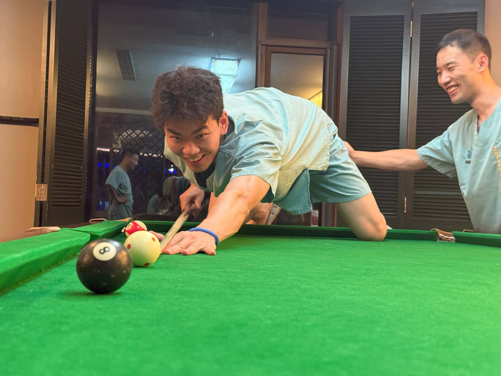
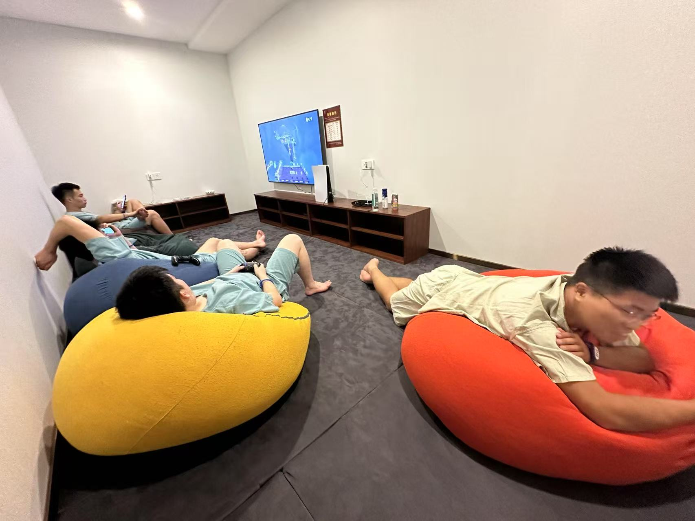
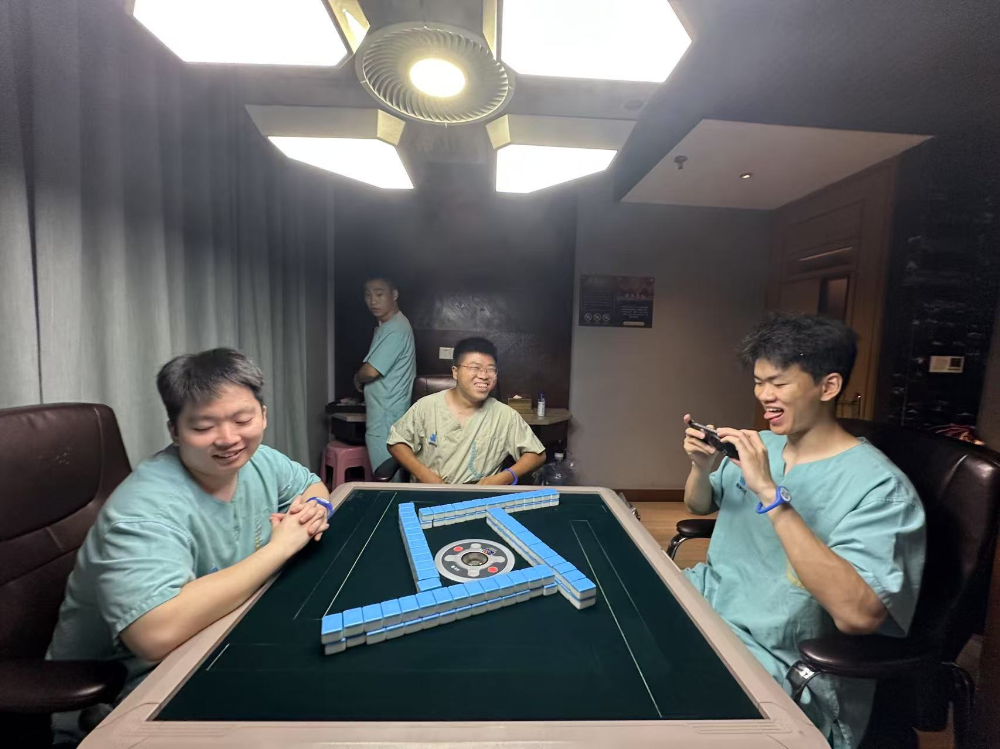
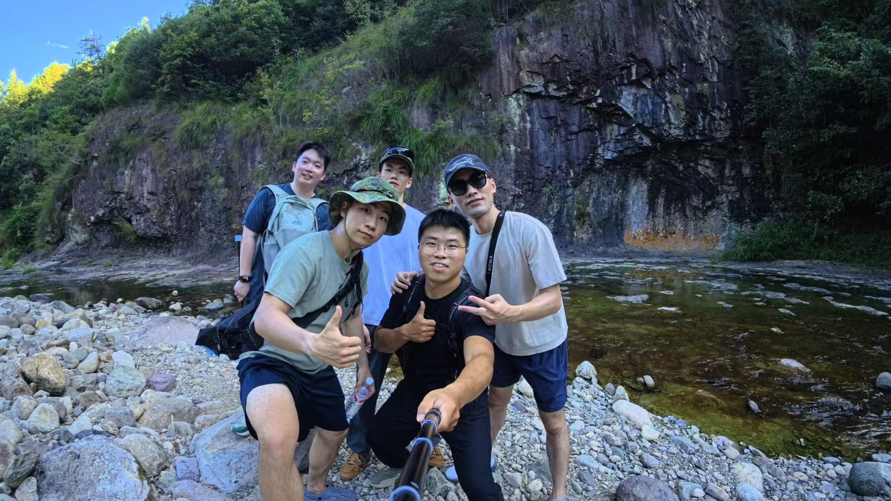
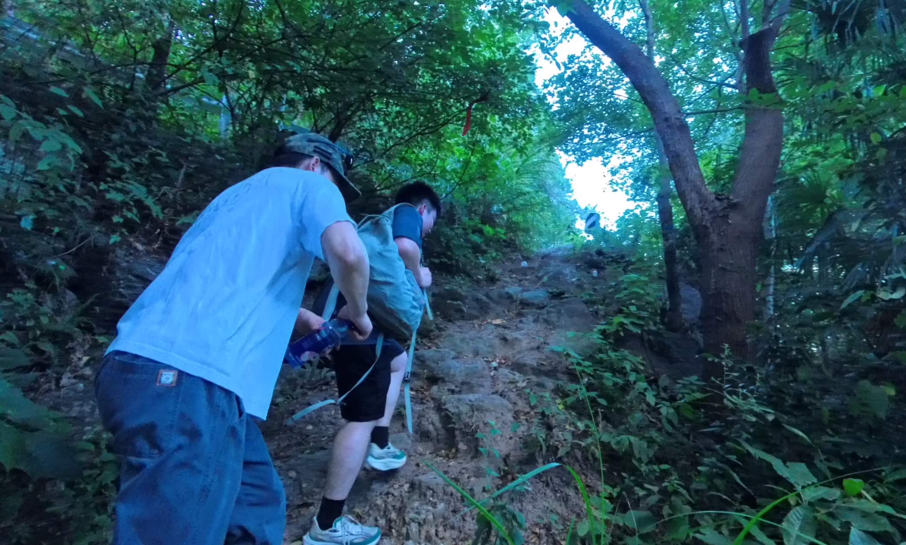
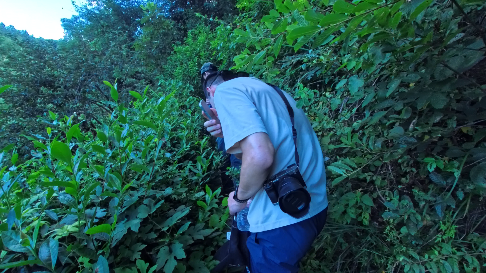
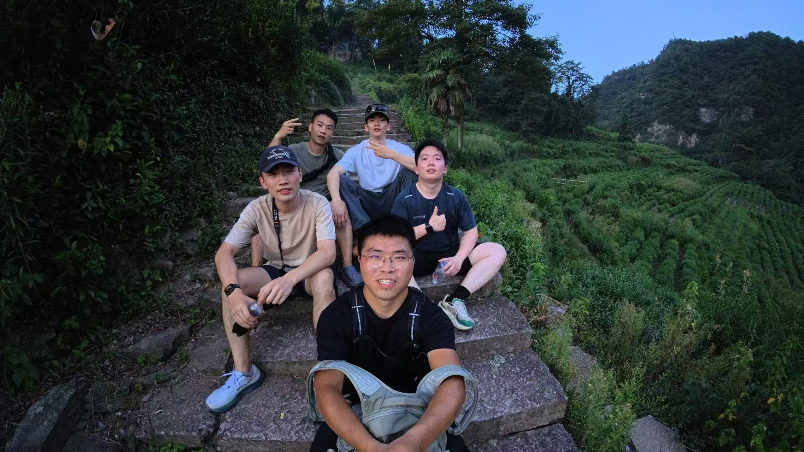

前几天和4个好兄弟一起自驾去了绍兴，我们租了一辆蔚来ET5。我们中午从交大出发，路上嘻嘻哈哈，东拉西扯，过一段路就换驾驶员体验新车，一点不觉得行程漫长。抵达绍兴大概下午3点，先去了鲁迅故居，逛了一圈，索然无味，随后就去了在车里计划好的留宿点，一家名为“海纳百川”的洗浴中心。当晚我们用极低的价格享受到了超高性价比的服务——自助餐、酒水饮料、汤池洗浴、桌球、乒乓、PS5、麻将，一应俱全，以至于我们在接下来的行程中还有些流连忘返，期待着下次再来。

由于前一天玩得过于放纵，快到正午我们才收拾完毕，开始出发去往此行的真正目的地——安山古道，来一次户外徒步。本以为是一次休闲的路线，刚出发时还对刚徒步完回来的驴友的提醒不以为然，觉得我们一定能轻松拿捏，不曾想后面的行程实在超出了想象。前一小段没有难度，一路上溪水潺潺，茶山青葱，我们在行进中嬉笑打闹，不时停下脚步美美合照。随着里程的增加，古道慢慢收窄，从青砖逐渐变为碎石，我们一行人的呼吸声也开始沉重。

继续走着，出现了栅栏，上面挂着警示牌——“前方施工，禁止通行”。可笑，我们是退伍军人，怎么能在此停下折返，这不是辱没了红军前辈们的长征精神，当即决定翻越栅栏继续前行。这一翻，后面的路程就从新手村直接来到了boss关。不仅是上山路，还要时刻注意着不知什么地方突然冒出的小野径，因为很有可能这就是路线app上规划的正确的线路。这些小野径还有共同的特点——两旁杂草丛生。我们一路披荆斩棘，战战兢兢前行。队伍里有后悔没穿长衣裤的，有叫嚷着要乘车下山的，也有一直默默领头和压队的，和为兄弟们打气鼓励的。每通过一个野径，抵达大路，就有种人间真好的感觉。这时候龙哥总会拿出相机喊大家合照，现在再看起这些照片，记忆被拉回到那时，无忧无虑，只用想着和兄弟们走好脚下的路。

终于，经历了蚊虫叮咬，腿上布满荆棘留下的红色血痕，我们登上了山顶。这里有座土地庙，边上住着管理寺庙的老大爷和他的孙子。大爷热情地询问了我们来时行程，并指明了下山的路途和时间，邀请我们进屋纳凉休息。聊天里得知大爷平日几乎不下山，偶尔下山也是去领略祖国别处的大好河山，即使我们觉得他的住处所在已是风光绝顶。饮了冰水，休憩完毕就继续上路，这之后就都是下山路了。虽然也是磕磕绊绊，碎石众多，但总归是知道离终点已然不远，能在太阳下山前赶到。最终也是不负众望，在抵达后我们留下了最具胜利结算意义的一段视频，大家齐声高呼“我嘞个xx！”

当晚，选择了一间5人入住的电竞酒店，房间里有张麻将桌，我们轮换着打到凌晨2点半。第二天回程途中，我们复盘着旅程，聊着聊着黄文鑫冒出一句：“回上海也要找家洗浴中心。”我们其他人相视而笑。中午到校后在思源门外吃了新开的赣小厨，用一顿下饭菜彻底结束了短暂几天快乐的旅程。